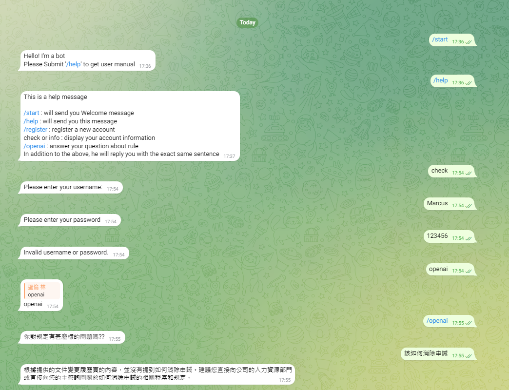

# ChatBot

## LINE BOT

1. python linebot_demo.py
2. activate ngrok on <http://localhost:8081>
3. submit webhook url on line developer

    **"/callback" must be added at the end**


## Telegram Bot

### telegram BotFather

1. First step : init your telegram bot

    ```text
    Search @BotFather
    submit "/newbot"
    And name this bot
    ```

    

2. Second step :　Save token

    ```plain_text
    it will generate the token
    copy this text to login_file
    ```

3. make your token path

    ```bash
    mkdir ./login_info
    nano ./login_info/aka_Marcus_bot.txt
    # paste token information
    ```

### activate your service

```bash
poetry env info
poetry lock
poetry install
poetry shell
python telegram_demo.py
```


